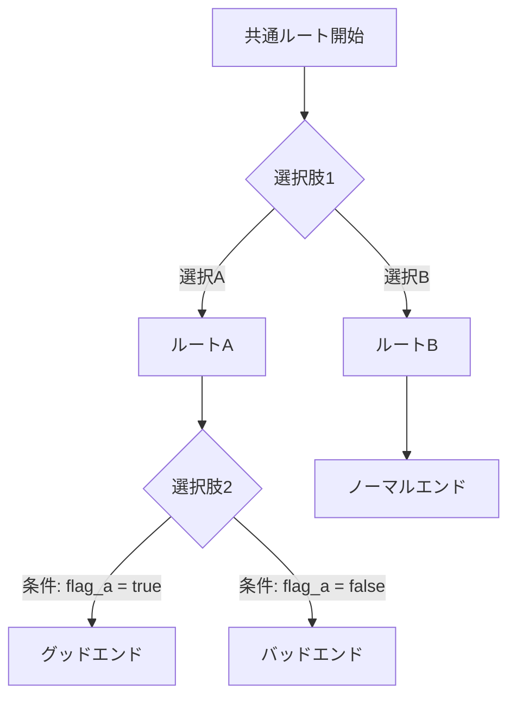

# ゲームシナリオ執筆支援

ゲームシナリオを「文章」ではなく「ゲーム状態を変化させる仕様（データ）」として設計する。
分岐と状態（フラグ）を先に設計し、後から文面を詰める工程を基本とする。

---

## 1. マクロ設計：物語構造の選定

### 4つの物語構造類型

ゲームシナリオの物語構造は以下の4類型に大別される。プロジェクト初期に選定し、全工程の前提とする。

| 構造類型 | プレイヤー体験 | 制作コスト | QA難度 | 典型的な落とし穴 |
|----------|--------------|-----------|--------|-----------------|
| **線形（Linear）** | 全員が同一イベント列を体験 | 低 | 低〜中 | 体験が受動的になりやすい |
| **分岐（Branching）** | 選択が結果に直接影響 | 高（指数的増大） | 高 | 選択肢爆発で収束不能 |
| **折り返し（Foldback）** | 選択の多様性と収束を両立 | 中〜高 | 高 | 選択が無意味に感じられる |
| **創発（Emergent）** | 物語がプレイから生成される | システム設計が重い | 非常に高 | 整合性の崩壊、テスト困難 |

### 選定基準

- **線形**：筆力で勝負するキネティックノベル、アクション主体でシナリオが補助的な作品
- **分岐**：マルチエンディングが体験の核。ルート横断型伏線を活用する場合に最適
- **折り返し**：物語の一貫性を保ちつつ選択感を出したい場合。コスト対効果のバランスが良い
- **創発**：オープンワールド・サンドボックス系。テキスト量よりシステム設計が支配的

---

## 2. 世界観構築（ワールドビルディング）

### 設計すべき要素

世界観はアートチーム・サウンドチーム等の「羅針盤」として機能する。以下を明文化する。

#### 物理的・魔法的法則
- その世界の自然法則（重力、物質、エネルギー）
- 魔法・超能力の体系（コスト・制約・禁則）
- テクノロジーの水準と限界

#### 国家・勢力・社会
- 地理と領土
- 国家間の政治関係（同盟・対立・中立）
- 経済構造（通貨・貿易・資源）
- 宗教・信仰体系

#### 価値観・文化
- 住人が共有する道徳観・倫理観
- タブーと禁忌
- 日常の生活様式

### 世界観ドキュメントの構成

```
世界観資料（バイブル）
├── 設定概要（1ページ要約）
├── 物理法則・魔法体系
├── 地理・歴史年表
├── 勢力・国家一覧
├── 用語集（表記揺れ防止）
└── 禁則事項（この世界で起こり得ないこと）
```

---

## 3. キャラクター設計

### 欲求・葛藤・成長の三軸

キャラクターの骨格は以下の3要素で定義する。

| 要素 | 定義 | 設計のポイント |
|------|------|---------------|
| **欲求（Desire）** | キャラクターが求めるもの | 表面的欲求と深層的欲求を分ける |
| **葛藤（Conflict）** | 欲求の実現を阻むもの | 外的葛藤（敵・環境）と内的葛藤（恐怖・矛盾）の両面 |
| **成長弧（Growth Arc）** | 物語を通じた変化の軌跡 | 成長・退行・不変のいずれかを意図的に設計する |

### 口調設定

キャラクターの口調は以下を明文化し、複数ライター間の一貫性を担保する。

- 一人称（俺/僕/私/あたし/我 等）
- 語尾の癖（〜だぜ/〜ですわ/〜じゃ 等）
- 敬語・タメ口の使い分け基準
- 感情別の口調変化（怒り・悲しみ・照れ 等）
- 禁止表現（そのキャラが絶対に言わないこと）

### キャラクターシートの構成

```
キャラクターシート
├── 基本情報（名前・年齢・外見・所属）
├── 欲求・葛藤・成長弧
├── 口調設定表
├── 人物相関図での位置
├── ルート別の役割変化（分岐作品の場合）
└── 秘密（プレイヤーに段階的に開示する情報）
```

---

## 4. プロット構成

### 起承転結と三幕構成の統合

日本のゲームシナリオでは起承転結と三幕構成は実質的に互換可能として扱う。

| 起承転結 | 三幕構成 | 機能 |
|---------|---------|------|
| 起 | Act 1（設定） | 世界・キャラ・状況の提示、事件の発端 |
| 承 | Act 2 前半（対立） | 葛藤の深化、サブプロット展開 |
| 転 | Act 2 後半（転換） | ミッドポイント、最大の危機 |
| 結 | Act 3（解決） | クライマックス、テーマの帰結 |

### 実務上の鉄則

- **結末から先に書く**：テーマは結末で明らかになる。全体を結末に収束させ、伏線を逆算的に配置する
- **箱書きを作成する**：物語を個別シーンに分解し、各シーンに番号・場所・時間・登場人物・存在意義・主要イベント・設定フラグを記載する
- **存在意義のないシーンは削除する**：すべてのシーンに物語的機能を持たせる

### ビジュアルノベル固有の適用

- **最初の100クリック以内に事件（Inciting Incident）を起こす**
- 日常パートは「退屈」ではなく「感情的投資」として設計する。日常で築いた愛着が後の喪失で感情的破壊力を生む
- 前半のスローバーン（日常・世界観構築）と後半のスリラー（転換・加速）の二分構成が有効

---

## 5. 分岐設計

### 8つの分岐パターン

ノベルゲーム・RPGで使用される分岐構造パターン。

| パターン | 構造 | 特徴 | 適合ジャンル |
|---------|------|------|-------------|
| **リニア型** | 選択肢なし一本道 | 筆力勝負。キネティックノベル | ホラー、文学系VN |
| **タイムケーブ型** | 選択ごとに完全分岐、再合流なし | コンテンツ量が指数的に増大 | 短編CYOA |
| **早期分岐型** | 短い共通ルート→各ルートへ | キャラ物語に早く没入。既読スキップ問題が軽減 | キャラクター重視ADV |
| **後期分岐型** | 長い共通ルート→終盤で分岐 | 世界観理解を深めた上での重い選択 | SF、ミステリ系VN |
| **ラダー型** | 共通ルートが本筋、各章でサブルート分岐 | 本筋の推進力を維持しつつキャラ掘り下げ | サスペンス、SF |
| **並行型** | 複数主人公が同時進行、相互影響 | 他人の行動で自分の運命が変わる | 群像劇 |
| **ガントレット型** | 間違い＝バッドエンド直行の実質一本道 | 生存チェックとしての緊張感 | サバイバル、デスゲーム |
| **ハブ型** | 中央拠点から複数方向へ探索、帰還 | 順不同の自由探索 | RPG、オープンワールド |

### フラグ管理

フラグは3種に分類して管理する。

| フラグ種別 | 用途 | データ型 | 例 |
|-----------|------|---------|-----|
| **ブーリアン型** | アイテム取得、イベント通過 | true/false | 鍵を入手済みか |
| **ポイント蓄積型** | 好感度、信頼度、道徳値 | 数値 | ヒロインAの好感度: 15 |
| **永続変数型** | 周回をまたぐデータ | 任意 | トゥルーエンド開放条件 |

### フラグ管理の実務

- 全フラグをスプレッドシートで一元管理する
- フラグ間の依存関係グラフを作成し、循環依存・到達不能を検出する
- 選択肢の3分類を明確にする
  - **展開変更型**：ルート・フラグを決定する選択肢
  - **情報整理型**：全選択で次に進む調査系選択肢
  - **雰囲気醸成型**：何も変えないロールプレイ用選択肢

### 状態空間の見積もり

分岐設計の複雑さを事前に把握するため、以下の指標を算出する。

- **テキスト量**：総文字数、重複率（同文の再利用率）
- **グラフ規模**：会話ノード数、分岐回数、再合流点数
- **状態空間**：フラグ数、変数数、永続化される状態の数
- **黄金ルート長**：クリアに必須な最短経路のイベント数

---

## 6. ミクロ執筆：テキスト制約と演出

### テキストボックス制約

ゲームテキストは物理的制約の中で書く。

- **文字数上限**：メッセージウィンドウに表示可能な文字数・行数を厳守する
- **テンポ管理**：会話のテンポを損なわず、読みやすく伝わる文章に圧縮する
- **改行位置**：テキストボックスのどこで改行するかは意味と緊張感を左右する演出手段

### テキスト表示形式

| 形式 | 特徴 | 適合ジャンル |
|------|------|-------------|
| **ADV形式** | 画面下部の小テキストボックス。テンポが速く視覚重視 | 恋愛ADV、アクションADV |
| **NVL形式** | 画面全体を覆う大テキストボックス。前の行が残り文学的密度が高い | ミステリ、ホラー、文学系 |
| **ハイブリッド** | 場面に応じてADV/NVLを切替 | 演出の幅を広げたい作品 |

### フレーバーテキスト

アイテム・武器・敵等の短い説明文。メインストーリーで長々と説明せずに世界の歴史や広がりを暗示する。

- 情報圧縮のスキルが要求される（詩的な洗練さ）
- 能動的な探索に対する「物語的報酬」として機能する
- 個々のテキストが相互に補完し合い世界観を補強する

### ビジュアルとテキストの重複禁止

**ビジュアルで表現されている要素をテキストで重複描写しない。**
キャラクターが俯く立ち絵があるなら「彼女はうつむいた」と書く必要はない。

### 演出指示の記述

台詞に加え、以下の演出指示をスクリプトに含める。

- 立ち絵の表情変更
- 背景切替
- BGM指定・SE（効果音）指定
- 画面効果（暗転、フラッシュ等）
- 音声収録用のト書き・感情指定

---

## 7. 出力フォーマット

### 成果物一覧

シナリオ執筆で生成する主要な成果物。

| 成果物 | 内容 | 形式 |
|--------|------|------|
| **世界観ドキュメント** | 法則・地理・歴史・用語集・禁則 | Markdown / Word |
| **キャラクターシート** | 欲求・葛藤・成長弧・口調・相関図 | Markdown / スプレッドシート |
| **プロット（箱書き）** | シーン単位の構成表 | スプレッドシート |
| **分岐図** | ノードグラフによる分岐構造の可視化 | Mermaid / 専用ツール |
| **条件表** | フラグ・変数の一覧と依存関係 | スプレッドシート |
| **台詞スクリプト** | 台詞・ト書き・演出指示 | エンジン固有形式 |
| **用語集** | 表記揺れ防止のための統一辞書 | スプレッドシート |

### 分岐図の記述例（Mermaid）



### 条件表のテンプレート

| フラグ名 | 型 | 設定箇所 | 参照箇所 | 依存フラグ | 説明 |
|---------|-----|---------|---------|-----------|------|
| flag_met_hero | bool | Ch1-Sc03 | Ch3-Sc12, Ch5-Sc01 | なし | 主人公と初回遭遇済み |
| affinity_heroine_a | int | Ch2-Sc05, Ch3-Sc08 | Ch5-Sc15 | flag_met_hero | ヒロインAの好感度 |
| persistent_true_end | bool | 2周目以降 | Ch6-Sc01 | 全ルートクリア | トゥルーエンド開放 |

---

## 8. 制作ワークフロー

### 6段階の制作フロー

1. **企画**：コンセプト決定、世界観設定、キャラクター設定、人物相関図
2. **プロット**：起点と終点を先に決め、構成法を適用し、全ルート・エンディング・フラグを設計
3. **箱書き**：シーン分解、各シーンに番号・場所・時間・登場人物・存在意義・フラグを記載
4. **本文執筆**：口調設定に従った台詞、ト書き、演出指示を含むスクリプト作成
5. **監修・統合**：レビュー、音声収録用台本との整合確認、選択肢フローのテストプレイ
6. **スクリプティング・QA**：エンジン固有フォーマットへの変換とデバッグ

### フィードバックループ

制作は一方向ではなく、テスト→脚本→構造設計への往復が発生する。
分岐や会話構造は早期に型を決めないと、実装・テストのコストが指数的に増える。

---

## 9. 使用方法

このスキルを呼び出す際は、以下の情報を提供してください。

- **作品ジャンル**：VN / RPG / アクションADV / オープンワールド 等
- **作業フェーズ**：企画 / プロット / 分岐設計 / キャラ設定 / 本文執筆 等
- **求める成果物**：世界観ドキュメント / キャラクターシート / 分岐図 / 条件表 等
- **既存の設定情報**：あれば提供（なければゼロから構築を支援）

### 呼び出し例

```
シナリオ執筆支援をお願いします。
- ジャンル: ビジュアルノベル（ミステリ系）
- フェーズ: 分岐設計
- 求める成果物: 分岐図と条件表
- 設定: [既存の世界観・キャラ情報を添付]
```
